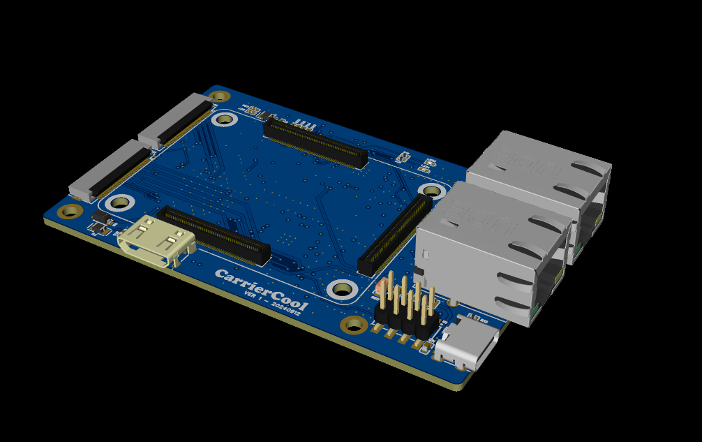

# OrangePi CM5 Carrier Board with Dual iMX415 Camera Connectors

- [x] 3 x 100p connector for OrangePi CM5 (Raspberry Pi CM4 compatible)
- [x] 2 x 1Gb Ethernet ports (not 2.5Gb)
- [x] 2 x 4-lane CSI for the camera module
- [x] power supply via USB type-C
- [x] SD card connector

